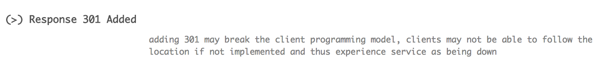
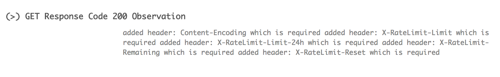
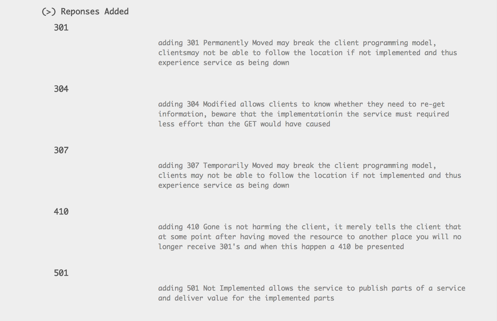
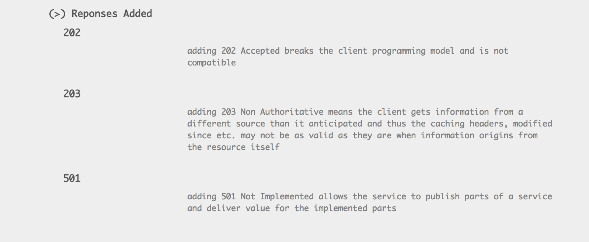
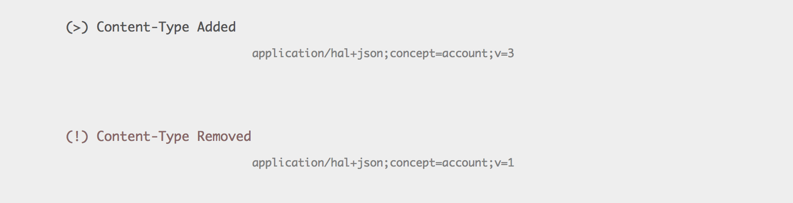
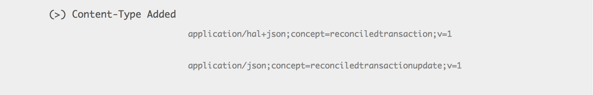
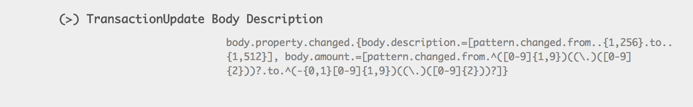
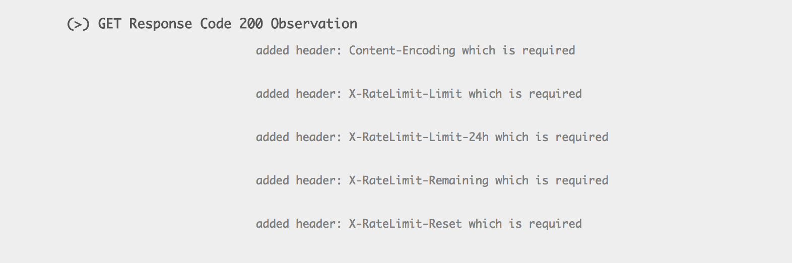
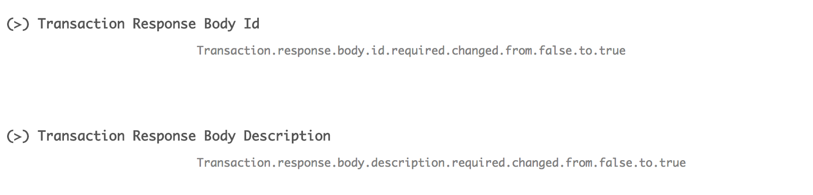

## Findings 
The findings are exemplified by the use of the HTML based report below. The idea is to show something visual along 
with an explanation of why this finding exist and why it is a part of the report.

*The section will be extended and changed over time*. 
_The text shown in the examples may change a bit compared to the report, these changes are pure phrasing and the pictures
will catch up_
 

### Examples (Opinionated)
Adding a response like `202` will break the backward compatibility of the API for that endpoint. If clients were not 
considering this response they would not react appropriate to the response. If the clients are used to get either a 
`200` or a `404`, they would not have considered `202` and following the `location` header after waiting the amount of time 
suggested by the `retry-after` header.  That is why this is considered a breaking change.

 
 
The `202` may be a response that services needs to introduce, if e.g. the time it takes to complete the response increases 
over time due to whatever reasons, it could be a creation of information that due to changes in legislation takes longer. 
Having clients waiting for a `200` a long time will be a pain for both the clients and for the service.
Therefore it is wise to consider if you need this response, you do not have to return the response before it is necessary. 
If you do not specify the `202` as a potential response you will have to introduce a new service version header like the 
`X-Service-Generation` and let the clients hang if they ask for the old version.
 
Adding ` (>) ` a `301` or `307` works in the same way as the `202`, if clients were not considering getting either of those 
back, the client would not be ready to react by following the `location` header to the new location of the endpoint.
Adding a `301` and `307` to your API makes it easier to move endpoints and having that as a part of your Open API 
specification may be worth considering.

 

 

Having an existing API ` (!) ` where a `301` or `307` is not defined is therefore reported as something you evaluate if yu want 
to include in your API or not.

 

Having the ability to offer a "service" to clients where they can ask if the need to re-read a resource or whether the 
client still has a valid version of the resource is the reason for including `304` in the potentially breaking part. 
Therefore an existing API without `304` might want to be extended with that, the reason for it being perceived as 
breaking is a scalability perspective as this can allow som services (having resources with a non-realtime character)
to scale higher (or have a lower operational cost for the same load).

 

The most frequent used responses are probably `200` and `404`, failing to have these as a part of the existing API or the 
new is considered a potential breaking change.

 
 
If the `200` is added to the new API it needs to include som headers like `X-Log-Token` to enable clients to refer to 
incidents in a way of their choosing and in that way handle bugs etc. more efficient, here the some headers concerning
rate limits are added as required by the service in the new version of the API, which makes a lot of sense, as they are 
required this is considered a breaking change to the new API.

 

If a client sets the `Accept` header to a content-type unknown to the server, some services are responding with a `400`, 
whereas the `415` seems more appropriate for this situation, in order to avoid breaking the API when introducing this 
response code later it seems like a good and sound idea to include this from the start.

 

Including a number of responses from the start seems to worth considering, which is why a number of these are considered 
potential breaks, se below.

 
 
Not having this as a part of your API means you cannot ask client politely to back off for 
a while (specified in the `retry-after`) header

 
 
This is a more specific error in the event of validation errors, in many situations the `400` is used and it may, the 
`412` is a little more precise for pre-conditional validation issues. `400` is considered as one of the mandatory alongside 
with `200` and `404`. It could be argued whether `412` should be mandatory or not, it differentiates itself from the `400` 
  by not having the requirement for the client to not repeat the request.

How long must you remember an endpoint, if you did not have the `301` or `307` specified and clients still uses the older 
endpoints and you know that you want to be able to terminate a given endpoint someday somehow. This is where `410` comes 
into the picture:

 

This is arguable whether this should be a mandatory response in every endpoint in a service or not, it is however worth 
considering whether it is something you need. If not specified, the contracts and terms for bringing an endpoint down 
must be clear. 

The `505` response is making ready for the next version of HTTP, so it is kind of along the lines of the `410`, can you bring 
endpoints down or can you cease the support for a given version of content, of API structure and how to do that using 
HTTP response code and other mechanisms to do it in a way that the clients can understand and follow.

 

The error handling from the services side are usually done by 500 and possibly 503 and thus they must be part of the 
responses that any endpoint can return.

 

 
 
 The `503` is suggested having a `retry-after` header to signal back to the client when the service is expected to be 
 available again, the aim of that is that clients can use this for information to the application user and thus informing 
 the users to prepare the user for this situation the best the client can. 
 
  
  
Adding that header and make it required is a potentially breaking thing as clients may not do anything about the header 
and thus the service downtime (or slow performance) may continue. Again here you could argue that this type of header
breaks nothing and clients will be able to continue regardless of this added header - and you would be right - therefore 
it would be nice to have people participating in finding the right amount of what is breaking, what is potentially 
breaking etc. or create a set of different profiles that allows people to have services that could have a label - 
e.g. with a certified level according to a given Open API Diff profile. 

The response code regarding authorization and access `401` and `403` must be part of any protected API and thus they 
are included in the mandatory set of responses here.

  

The elaborated part of the reports attempt to state a few words on the observation:

  

and 

  

On top of that there are som even more opinionated parts, such as the parts on using content-types as versioning 
mechanism for content in endpoints:

  

  

  
And concrete observations like: 

  

  

  

  

And:

  

  
  
And suggested improvements to the existing design - here in the form of suggesting that null is not a good definition 
to have in the API, because it creates uncertainty going forward with your design and the greater the number of client 
the services have the larger the risk for various interpretations of a given set of input or output and thus the service 
developers themselves are less clear on what the clients may experience as a result of a change.

  

And:

  

## Opinionated parts
The opinionated parts are:

 * that [HAL](https://tools.ietf.org/html/draft-kelly-json-hal-08) is used as the way to do HATEOAS, 
 * a version paradigm based on content-type parameters for the endpoint content versioning
 * a version paradigm based on a HTTP header for the API structure versioning
 
### Versioning Content in an Endpoint
The opinionated parts are not used just to be different, they serve a purpose. The use of the versioning mechanism by 
content-type parameters are an elegant way to ease the effort for clients (service users) and maintain speed for the 
evolution of services. The versioning paradigm works as follows:

 1. The service is published with a default producer and a specific producer for a given endpoint:
    * application/hal+json (the default producer)
    * application/hal+json;concept=account;v=1

This allows clients to use the application/hal+json in their Accept header to signal to the service "I am ready for the
newest content produced at the endpoint" - the service makes sure that the `content-type` is set in every HTTP response 
every time the client gets and answer back from the endpoint, in this case that content-type is
 `application/hal+json;concept=account;v=1`. 

After a while the service endpoint must upgrade the content in the endpoint and thus it adds a producer to the endpoint. 

 2. The Service now supports the following producers:
    * application/hal+json (the default producer)
    * application/hal+json;concept=account;v=1
    * application/hal+json;concept=account;v=2

The clients uses the application/hal+json in their Accept header to signal to the service "I am ready for the
newest content produced at the endpoint" - as they may not know that the updated version can also be served from the 
endpoint. Clients can however see that a new version has been introduces as the services now sets the `content-type` 
response header set to `application/hal+json;concept=account;v=2`. 

If the client(s) do not experience any problems with the upgraded version the older one can be deprecated and taken out 
of "production" - on the other hand - if there are clients that experience problems, they can revert to the old version 
 (while they make the necessary change to the client code) by setting the `Accept` header in their requests for the service 
to `application/hal+json;concept=account;v=1` and get the older version served a little longer. Clients can get help from 
their users by having a way that users can report "things that look strange" and that could be reacted to (from the client
code) by fall-back to the last known working content-type for a given endpoint.
Examples of code that uses this principle can be found in the [HATEOAS](https://github.com/Nykredit/HATEOAS/tree/alledgedContentTypeSupport) 
project, a there is a branch showing this principle including support for cross container routing, if a container is used.

Using this principle the [type](https://tools.ietforg/html/draft-kelly-json-hal-08#section-5.3) from the  `_link` 
defined by HAL can be empty as long as the client did not observe any problems with the default 
content-type `application/hal+json`. 

### Versioning the API 
A service API can change from a structural perspective, endpoint may move elsewhere. A service want to do the best it can 
in order to serve clients in the best possible way and thus client are required to set a HTTP header called 
`X-Service-Generation` in order to signal the clients expectation to the service. If the service makes sure that it 
includes response codes like [`301`]((https://www.w3.org/Protocols/rfc2616/rfc2616-sec10.html)), 
[`307`]((https://www.w3.org/Protocols/rfc2616/rfc2616-sec10.html)) etc. in its response code set in the API definition, 
the client knows that it needs to react on these responses in form of following the `location` header to the new 
destination. The alternative is that the clients get the experience of a "service being down" which makes clients unhappy. 
 
If a service adds [`202`]((https://www.w3.org/Protocols/rfc2616/rfc2616-sec10.html)) Accepted as a response code, that 
may also break clients as they may not have included in their programming model that a `202` could occur, which means 
the client does not take into account that it need to follow the `location` header and wait for the amount of time
suggested by the `retry-after` header

### Other opinionated parts
The inclusion of [`415`](https://www.w3.org/Protocols/rfc2616/rfc2616-sec10.html), 
[`500`](https://www.w3.org/Protocols/rfc2616/rfc2616-sec10.html)
and [`429`](https://tools.ietf.org/html/rfc6585#page-3) and others in the fixed set of response codes that should be 
considered in an API in order to make the evolution simpler for the clients and thus give the service implementers the 
ability to move fast and stay competitive. This is not something that is be`ing enforced on you, it will be possible to 
configure your own profile at some point in time in the tool if it brings value to enough people.
