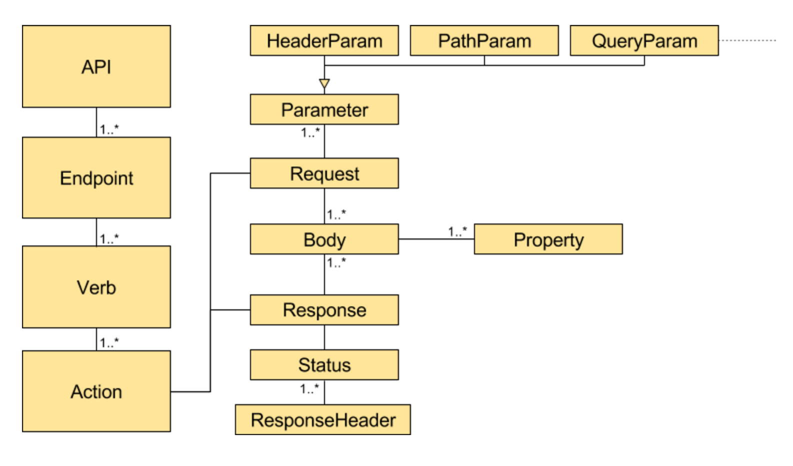
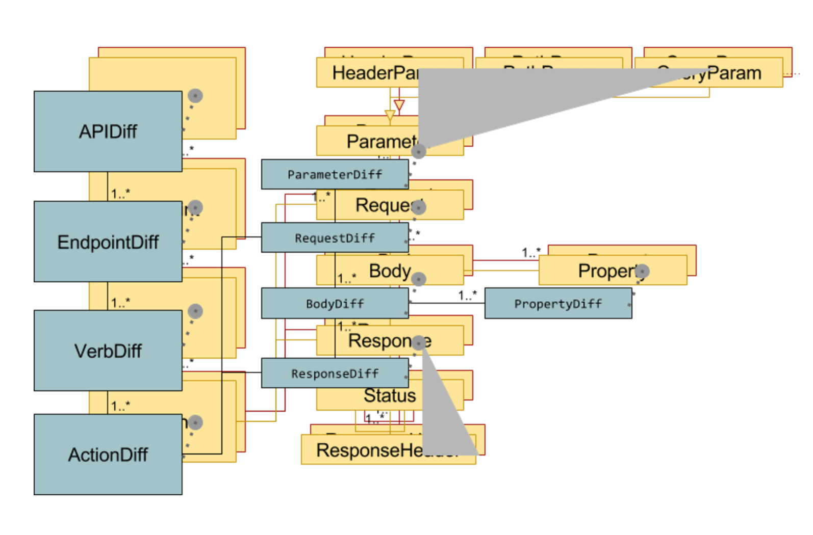

# The project Open API Diff

The project is an attempt to create a tool that will help service developers to have a maximal speed for continuous 
development and deployment aka. aka continuous delivery. The basic idea is to help the services evolve at high speed, 
thus ensuring that the consumers of the services can continue their operation, whilst the service evolves and thus stay
relevant to its consumers. This can probably be done in a number of ways, so consider this an opinionated way to do that using HAL and 
content-type based versioning of content.

## A little background
A model was created initially for the individual API

This quickly ends up being close to what the swagger model already contains.
The comparison ends up being something along the lines of:

It seemed a very complex way to perform the comparison between two editions of the "same" API and the need for containing specifics concerning the comparison criteria seem to be able to be contained in a simpler structure. I think there is a smell to the project as it seems very tree-oriented and a better model for the comparison would be welcomed a lot. However for now the model is using the swagger model as the domain model and mainly the comparison model is part of the project. 

### The Structure
The tool is in a relative initial and rudimentary state and the focus is on using the objects that are a result from 
the reading of the Open API specification version 2 (read by SwaggerParser). The classes found in 
`dk.hoejgaard.openapi.diff.criteria` are the ones concerned with the API level comparison using the `criteria`, the individual `diff` classes handles the differences between the two editions of the API element and the `changes` evaluates the elements in a greater detail. Everything is gathered together for a `report`. 

#### The Criteria
There is a couple of criteria that can be set in order to adjust the depth of the comparison and the maturity og the 
API as well as the number of versions - if the opinionated version scheme is used. These criteria can be found under
`dk.hoejgaard.openapi.diff.criteria`.

#### The Diffs
The Diff classes looks at the differences between the existing and the future candidate API and with the help from the changes classes the issues found are set to be breaking, potentially breaking or design improvement suggestions to the future or existing API edition. If you look at the model the `EndpointDiff`, `VerbDiff` and the `ActionDiff` is currently `ResourceDiff` and `OperationDiff`, where the current `ParameterDiff` handles what the `BodyDiff`, `PropertyDiff` and `ParameterDiff` was initially considered to be doing. The reason for that was imho that it was the simplest implementation for the current functionality. 

#### The Report
The resulting reports are found under `dk.hoejgaard.openapi.diff.output` and currently there are console/text, markdown 
and html. 

### The future
If the tool is evaluated to create value, the structure could evolve into something better, therefore suggestions, improvements etc. are welcome.
It would be great if the tool could evolve into something valuable for service development and deployment and thus could help optimize the business value possible to deliver.
 

